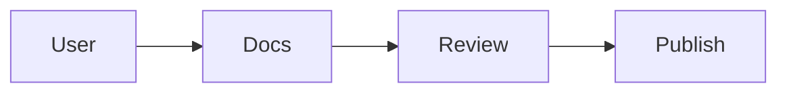
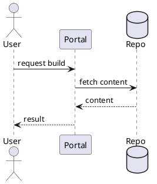
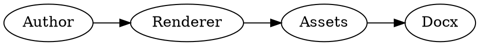

## Overview

This document is a render test for the local Kroki-backed DOCX flow. Each
section shows a small source snippet followed by the rendered diagram so the
generated DOCX can be reviewed for layout, image scaling, and language support.

## Mermaid

Source:

```text
flowchart LR
    User --> Docs
    Docs --> Review
    Review --> Publish
```

Rendered:



## PlantUML

Source:

```text
@startuml
actor User
participant Portal
database Repo
User -> Portal : request build
Portal -> Repo : fetch content
Repo --> Portal : content
Portal --> User : result
@enduml
```

Rendered:



## Graphviz

Source:

```text
digraph G {
  rankdir=LR;
  Author -> Renderer;
  Renderer -> Assets;
  Assets -> Docx;
}
```

Rendered:



## D2

Source:

```text
DevSpace -> Kroki
Kroki -> DOCX
```

Rendered:

```d2
DevSpace -> Kroki
Kroki -> DOCX
```

## Seqdiag

Source:

```text
seqdiag {
  Developer -> Renderer [label = "render doc"];
  Renderer -> Kroki [label = "convert diagram"];
  Kroki => Renderer [label = "PNG"];
  Renderer => Developer [label = "DOCX"];
}
```

Rendered:

```seqdiag
seqdiag {
  Developer -> Renderer [label = "render doc"];
  Renderer -> Kroki [label = "convert diagram"];
  Kroki => Renderer [label = "PNG"];
  Renderer => Developer [label = "DOCX"];
}
```

## Pikchr

Source:

```text
box "Author" "writes markdown"
arrow
box "Renderer" "rewrites diagrams"
arrow
box "DOCX" "final output"
```

Rendered:

```pikchr
box "Author" "writes markdown"
arrow
box "Renderer" "rewrites diagrams"
arrow
box "DOCX" "final output"
```

## Review Notes

- Confirm each rendered diagram stays within a reasonable page footprint.
- Confirm the code snippets remain visible as text in the DOCX.
- Confirm the output works for Mermaid plus five additional diagram languages.
