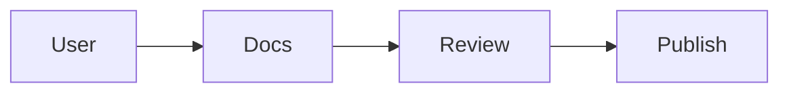
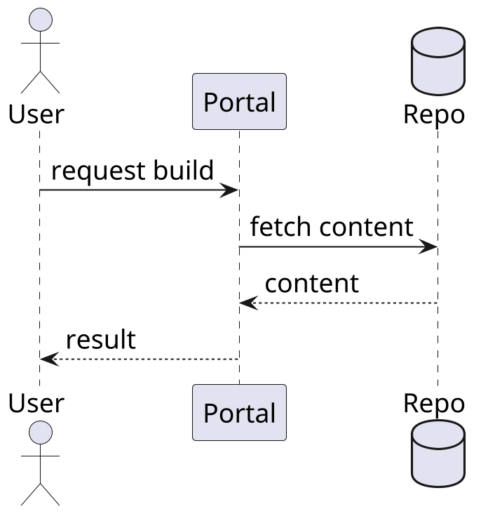
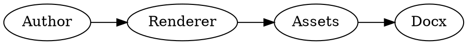

## Overview

This document is a render test for the local Kroki-backed DOCX flow. Each
section shows a small source snippet followed by the rendered diagram so the
generated DOCX can be reviewed for layout, image scaling, and language support.

## Mermaid

Source:

```text
flowchart LR
    User --> Docs
    Docs --> Review
    Review --> Publish
```

Rendered:



## PlantUML

Source:

```text
@startuml
skinparam dpi 200
skinparam defaultFontSize 18
actor User
participant Portal
database Repo
User -> Portal : request build
Portal -> Repo : fetch content
Repo --> Portal : content
Portal --> User : result
@enduml
```

Rendered:



## Graphviz

Source:

```text
digraph G {
  rankdir=LR;
  Author -> Renderer;
  Renderer -> Assets;
  Assets -> Docx;
}
```

Rendered:



## C4PlantUML

Source:

```text
@startuml
skinparam dpi 200
skinparam defaultFontSize 18
!include <C4/C4_Container>

Person(author, "Author")
System_Boundary(docs, "Docs Flow") {
  Container(renderer, "Renderer", "Python")
  Container(kroki, "Kroki", "HTTP service")
}

Rel(author, renderer, "renders")
Rel(renderer, kroki, "requests PNG")
@enduml
```

Rendered:

```c4plantuml
@startuml
skinparam dpi 200
skinparam defaultFontSize 18
!include <C4/C4_Container>

Person(author, "Author")
System_Boundary(docs, "Docs Flow") {
  Container(renderer, "Renderer", "Python")
  Container(kroki, "Kroki", "HTTP service")
}

Rel(author, renderer, "renders")
Rel(renderer, kroki, "requests PNG")
@enduml
```

## Seqdiag

Source:

```text
seqdiag {
  Developer -> Renderer [label = "render doc"];
  Renderer -> Kroki [label = "convert diagram"];
  Kroki => Renderer [label = "PNG"];
  Renderer => Developer [label = "DOCX"];
}
```

Rendered:

```seqdiag
seqdiag {
  Developer -> Renderer [label = "render doc"];
  Renderer -> Kroki [label = "convert diagram"];
  Kroki => Renderer [label = "PNG"];
  Renderer => Developer [label = "DOCX"];
}
```

## Blockdiag

Source:

```text
blockdiag {
  orientation = portrait;
  Author [label = "Author"];
  Renderer [label = "Renderer"];
  Docx [label = "DOCX"];
  Author -> Renderer -> Docx;
}
```

Rendered:

```blockdiag
blockdiag {
  orientation = portrait;
  Author [label = "Author"];
  Renderer [label = "Renderer"];
  Docx [label = "DOCX"];
  Author -> Renderer -> Docx;
}
```

## Review Notes

- Confirm each rendered diagram stays within a reasonable page footprint.
- Confirm the code snippets remain visible as text in the DOCX.
- Confirm the output works for Mermaid plus five additional diagram languages.
