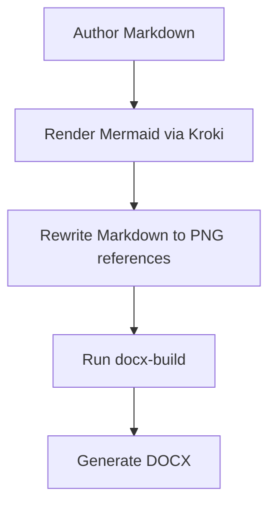

## Overview

This document is a test input for the experimental Kroki-backed DOCX renderer.
It verifies that Markdown, Mermaid diagrams, lists, tables, and blockquotes all
survive the rewrite and final `docx-build` step.

## Architecture Flow

## Notes

- The renderer should replace the Mermaid fence with a PNG image reference.
- The DOCX output should keep heading numbering and body styling.
- This branch uses a local Kroki sidecar in the Dev Space pod.

## Decision Summary

| Area | Decision | Reason |
|---|---|---|
| Diagram rendering | Kroki sidecar | Keep Mermaid conversion local to the Dev Space |
| DOCX conversion | `docx-build` from `dac-toolkit` | Reuse existing renderer |
| Runtime model | Workspace-local script | Standard developer permissions |

## Security Considerations

> The render flow should stay inside the workspace and use only the Dev Space
> sidecar services that are available to standard developers.

## Next Step

Render this file to confirm the workflow can produce a DOCX with an embedded
diagram and standard metadata sections.
