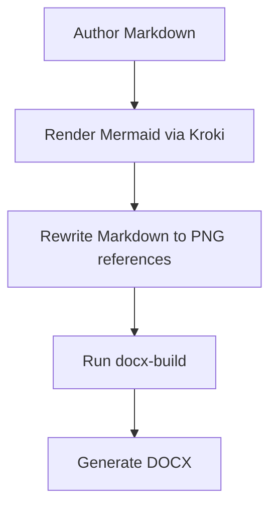

## Overview

This document is a focused Mermaid smoke test for the experimental
Kroki-backed DOCX renderer.

## Architecture Flow

## Notes

- The renderer should replace the Mermaid fence with a PNG image reference.
- The DOCX output should keep heading numbering and body styling.
- The broader multi-language coverage test lives in
  `examples/docx/sample-diagram-gallery.md`.
